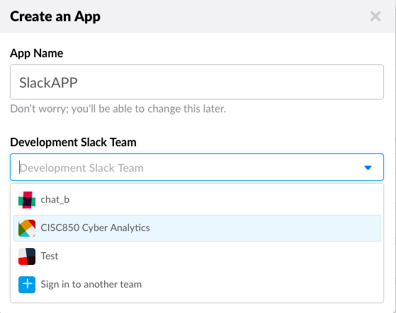
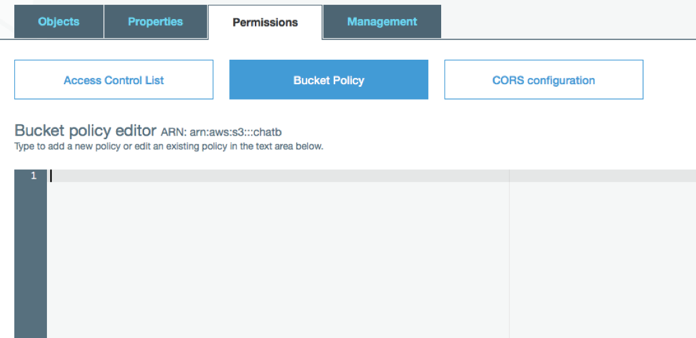

# Front-End Configuration
The following is a walkthrough on how to set up the front-end configuration of the Cyber Chatbot. The front-end configuration has to be set in the following places: <br> 
  1) Slack 
  2) IAM (AWS)  
  3) S3 (AWS) 

 The walkthrough will show how to create an App in Slack, where the steps will guide in setting up the configurations necessary for a chatbot. In order to make the unique calls from the user to Virus Total and Flask, Slack slash commands ```/flask``` and ```/vt``` is being utilized. The Front-end configuration of the Slack will guide in making said Slack slash commands as well as setting up a custom bot which is the Cyber Chatbot with permissions on file upload in Slack from the user.<br> 

 The IAM service of AWS will help us in creating a user and configuring it's access policy for the following AWS services:
  1) **Lambda**: 
  The IAM policy on Lambda will allow us to connect and create our slash command files (Lambda functions utilizing the Access key and secret access key which we will generate) from EC2 through ClaudiaJS.
  2) **S3**:
  The IAM policy on S3 will give permissions for the file upload module to access S3 bucket and store files. It will also allow our slash commands retrieving those files.


 The configuration on the S3 service is also needed in the allowing the Slack slash command in accessing the stored files in the S3 bucket. 


## Configuring Slack

### Creating Slack App
 1. Go to https://api.slack.com/apps
 2. Create new App<br>
  Make a unique name for **App Name** and choose **Development Slack Team** 
    <br><br>
    With that the app is created.<br>
    We are directed to the "Basic Information" of the app. Use this below image as reference when setting permissions and creating slash command<br><br>
    <br><br>
 3. Setting Permissions<br>
  Go to **OAuth & Permissions** found under **Features** in the side menu.<br> 
 4. Scroll to **Permission scope** Heading<br>
  <br>
  Set the following Permission Scopes for the app:
   * files:read
   * files:write:user
   * bot<br><br>
   Click on **Save changes** button 
 5. Go to **Bot Users** found under **Features**. <br>
  Click on **Add a Bot User**.<br>
    <br>
  Enter a unique a **Default username** and click on the **Add Bot User** button.
    <br>
 6. Go to ***Install App** Found under **Settings**.<br>
  Click on the **Install App** button.<br> 
  Click on the **Authorize** button.
  Copy the **OAuth Access Token** which is the App ID.<br> 
  Copy the **Bot User OAuth Access Token** which is the Bot ID.
 7. Done

### Creating Slack Slash Command
 This section will guide in making the first custom slash command which was followed to make ```/vt``` and ```/flask```
 1. In "Basic Information" page, Go to **Slash Commands** under **Features** in the sidebar.
 2. Click on the **Create New Command** button.
 3. Write a custom text to be the slash command,<br>
   Copy the Request URL after executing ```claudia update --configure-slack-slash-command``` when updating slash command in EC2.<br>
  

 4. Go to **Basic Information** under **Settings**<br>
  Scroll to **App Credentials** and copy the **Verification Token** of the App
 5. Paste the Token in EC2 when asked for **Slack token**.<br>
   Type ```json``` for **Outgoing webhook token**.<br>
   NOTE: You will be asked to reinstall the app if this is the first slash command, proceed to reinstall and authorize. 
 6. Done.
 


## Configuring AWS IAM
This section will contain configurations on the IAM module.

### Enabling access
 1. In AWS console go to IAM service
 2. Click on the __Users__ link in the left panel menu.
 3. Add User
 While Adding User, in the detail's section, go to Select AWS access type and enable **Programmatic access** and **AWS Management Console access**.

 In the permission's section, Attach existing policies directly<br>
 


 Under “Policy Type” enable the following for the user:

 * AmazonS3FullAccess <br>
 * AWSLambdaFullAccess <br>
 * AmazonAPIGatewayAdministrator<br>
 * IAMFullAccess<br>
 
 Then proceed to complete the remaining steps to create user.<br> 
 On creating user copy and store the **Access key ID** and **Secret Access key** and use in different steps in different modules. 
 In order to add the three given policies later, you can go back to __Users__ and go to a created User and make the needed changes.


## Configuring AWS S3
This section will contain will contain configurations on the S3 module.

 1. In AWS console go to S3 service. 
  <br><br>
 2. Create a bucket. <br>
 Enter a unique bucket name and Select region and proceed with the other steps to create bucket <br><br>
 <br><br>
 3. Add bucket policy to the bucket for the file upload:<br><br>
 <br><br>
 ```json
	 {
	 	"Version": "2012-10-17",
	 	"Id": "*******",
		"Statement": [
			{
				"Sid": "*******",
				"Effect": "Allow",
				"Principal": "*",
				"Action": "s3:*",
				"Resource": "arn:aws:s3:::<ENTER BUCKETNAME>/*"
			}
		]
	}
 ```
 ```<ENTER FOLDERNAME>``` is the name of the bucket.<br>
 4. Done.